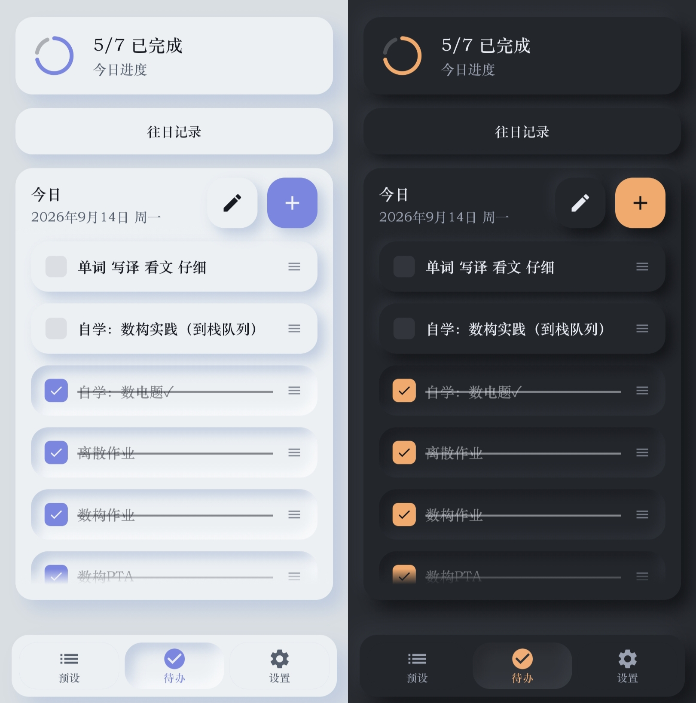
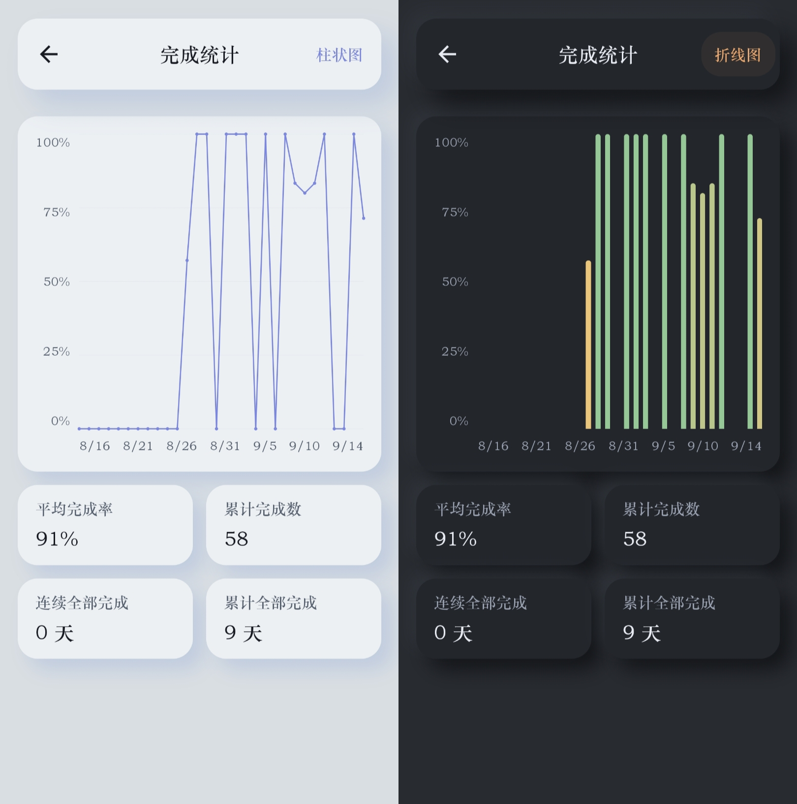
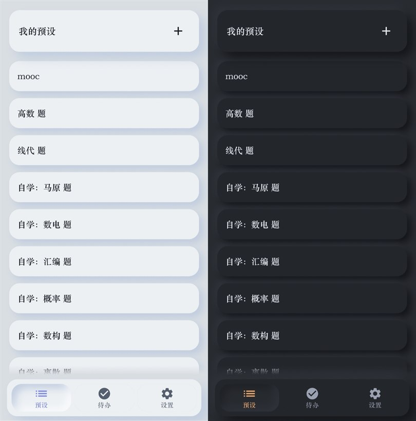
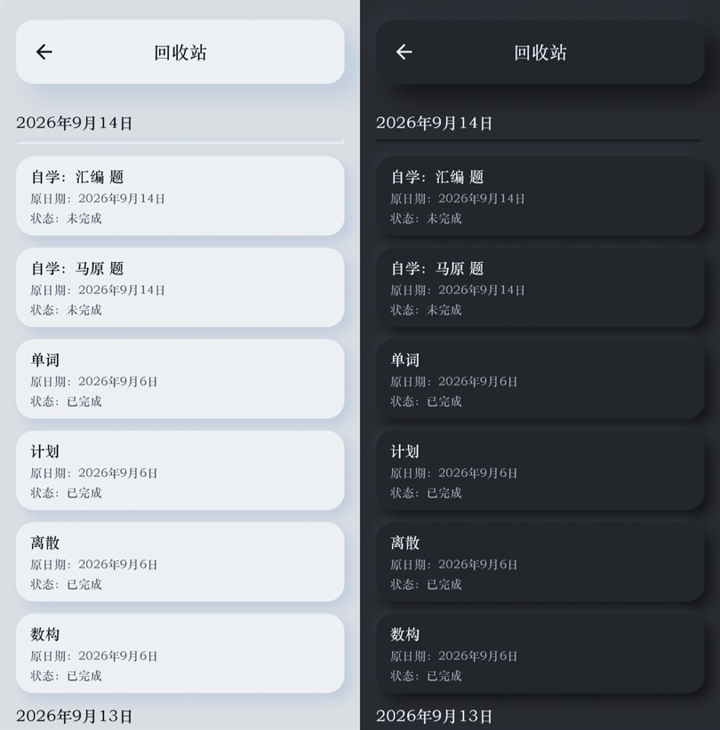
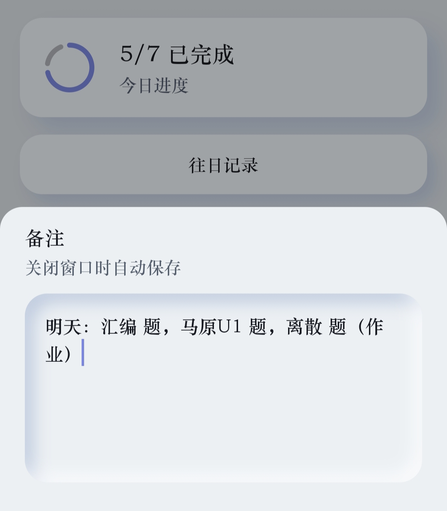
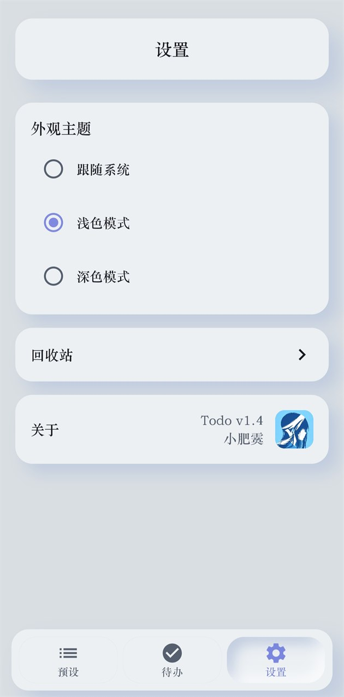

<div align="center">

# Todo

**新拟态风格（Neumorphism）的 Android 每日待办清单**

Kotlin 2.2 · Jetpack Compose · Room · 纯本地存储 · 无网络权限

-3DDC84?logo=android&logoColor=white)


[**下载 v1.4 APK**](https://github.com/aliezXDD/Todo/releases/latest)

</div>

---
因为网上待办软件功能太繁杂、页面不清晰所以自己做了一个，只有待办、预设、备注、统计这些常用功能，下面是AI出来的软件操作、项目相关readme，希望大家用得开心ヾ(≧▽≦*)o

一个只把「每天列清单 → 打勾完成 → 看完成率变化」这件事做好的待办应用。

界面是完整的新拟态风格：凸起的卡片、凹陷的输入框、按下去会陷进去的按钮，浅色和深色各一套。所有数据只存在手机上，应用**不申请任何权限**——连网络权限都没有（`AndroidManifest.xml` 里没有任何 `<uses-permission>`）。

## 截图

> 除备注、设置外，每张图左侧为浅色模式、右侧为深色模式。

**今日待办**：进度环 + 当天清单 + 底部导航



**完成统计**：柱状图 / 折线图可切换，下方四张历史统计卡片



**预设**：把常用待办存下来，随取随用



**回收站**：删除的待办可还原，按原日期分组



**备注**：全局一条，关闭窗口自动保存



**设置**：主题切换、回收站入口、版本信息



## 操作说明

### 今日待办（首页）

| 操作 | 效果 |
| --- | --- |
| 点左侧勾选框 | 标记完成 / 取消完成，完成项自动加删除线 |
| 点条目本身 | 打开编辑弹窗，可改内容，或删除这条待办 |
| 按住右侧 `≡` 拖动 | 调整当天清单顺序，顺序会保存 |
| 点右下角 `+` | 打开添加待办弹窗 |
| 点 `+` 左边的铅笔 | 打开备注弹窗 |
| 点「往日记录」 | 进入往日记录页，按天回看历史清单 |

### 添加待办弹窗

| 操作 | 效果 |
| --- | --- |
| 输入内容后点「添加」 | 新增一条今日待办 |
| 点某个预设 | 该预设立刻变成一条今日待办 |
| 长按某个预设 | 进入多选模式，勾选多条后一次全部添加 |
| 在搜索框输入 | 过滤预设（预设很多时用） |

### 备注弹窗

| 操作 | 效果 |
| --- | --- |
| 输入文字 | 关闭窗口时自动保存 |
| 内容超过输入框高度 | 框内滚动查看 |

备注全局只有一条，不会随日期清空，随时可以回来改。

### 往日记录

| 操作 | 效果 |
| --- | --- |
| 上下滚动 | 按日期从新到旧查看每天的清单与完成情况 |

### 完成统计

| 操作 | 效果 |
| --- | --- |
| 点右上角按钮 | 在柱状图 / 折线图之间切换 |

图表画的是最近 30 天（没有待办的日子按 0 补齐，横轴才连续）；下方四张卡片是历史口径：平均完成率（只统计当天真有待办的日子）、累计完成数、连续全部完成、累计全部完成。

### 预设页

| 操作 | 效果 |
| --- | --- |
| 点右上角 `+` | 新建预设 |
| 点某条预设 | 打开编辑弹窗，可改内容 |
| 双击某条预设 | 直接添加为今日待办 |
| 长按某条预设 | 进入多选模式，顶栏可全选 / 删除选中项 |

### 回收站

| 操作 | 效果 |
| --- | --- |
| 长按任意条目 | 进入多选模式 |
| 在多选模式下点其它条目 | 加选 / 取消选中 |
| 顶栏「还原」 | 还原回它原来的日期 |
| 顶栏「永久删除」 | 彻底删除（二次确认，不可恢复） |
| 按返回键 | 退出多选模式 |

### 设置

| 操作 | 效果 |
| --- | --- |
| 外观主题 | 跟随系统 / 浅色模式 / 深色模式 |
| 回收站 | 进入回收站页面 |
| 关于 | 显示当前版本号 |

## 时间与数据规则

- **一天从凌晨 4 点开始**：00:00–03:59 记在「昨天」，熬夜打卡不会把清单算到新的一天上。
- **自动归档**：应用启动时和每天定时任务会补齐历史统计；把 **7 天前**的待办移入回收站；清理回收站里 **超过 30 天**的记录。
- **数据全部在本机**：Room 数据库（待办、预设、回收站、每日统计）+ DataStore（主题、备注、归档日期）。没有账号、没有云同步。

## 技术栈

| 项 | 版本 |
| --- | --- |
| 语言 / UI | Kotlin 2.2.10、Jetpack Compose（BOM 2026.02.01）、Material 3 |
| 架构 | 单模块分层：`data` / `domain` / `ui` / `worker` / `util`，UseCase 承载业务 |
| 依赖注入 | Hilt 2.59（含 hilt-work） |
| 本地存储 | Room 2.7.2（KSP）、DataStore Preferences 1.1.1 |
| 后台任务 | WorkManager 2.9.0（每日归档） |
| 其他 | Navigation Compose、Coroutines / Flow、`sh.calvin.reorderable`（拖拽排序） |
| 构建 | AGP 9.2.1、Gradle 9.4.1、JDK 17、compileSdk / targetSdk 36、minSdk 31 |

## 项目结构

```
app/src/main/java/com/todo/
├── MainActivity.kt              # 单 Activity，处理启动闪屏与主题
├── TodoApp.kt                   # Application：Hilt 入口 + 启动归档
├── data/
│   ├── local/                   # Room 实体 / DAO / 数据库 / DataStore
│   └── repository/              # 待办、预设、回收站、统计四个仓库
├── domain/
│   ├── model/                   # 领域模型
│   └── usecase/                 # 业务用例（增删改、排序、归档、清理、统计）
├── ui/
│   ├── component/               # 拟态基础组件（卡片、按钮、弹窗、FAB、Toast…）
│   ├── navigation/              # 底部导航与 NavGraph
│   ├── screen/                  # 待办 / 统计 / 预设 / 回收站 / 设置 / 历史
│   └── theme/                   # 颜色、字体、形状、拟态光影、动画参数
├── util/                        # 日期工具（逻辑日）、常量
└── worker/                      # 每日归档定时任务
```

## 关于拟态实现

- 光影全部用 Compose `Canvas` 自绘（偏移 + `BlurMaskFilter` 模糊），没有引入任何第三方拟态 UI 库。
- 全项目统一一个圆角半径 **18dp**；凸起 = 浅色高光 + 深色投影，凹陷 = 反向路径裁剪出的内阴影。
- 按压反馈是「凸起 → 凹陷」的连续过渡，不是简单的透明度或缩放变化。
- 浅色模式下凸起面不加白色高光（纯白在浅灰底上会显脏），深色模式才用亮色描边。

## 构建

需要 JDK 17+ 与 Android SDK Platform 36。

```bash
# 调试包
./gradlew assembleDebug        # Windows: gradlew.bat assembleDebug

# 正式包（需先配置签名，否则产物未签名）
./gradlew assembleRelease
```

发布签名从 **`local.properties`**（已被 `.gitignore` 忽略）或同名环境变量读取，未配置时 release 产物保持未签名：

```properties
RELEASE_STORE_FILE=../todo-release.jks
RELEASE_STORE_PASSWORD=******
RELEASE_KEY_ALIAS=******
RELEASE_KEY_PASSWORD=******
```

## 下载与安装

到 [Releases](https://github.com/aliezXDD/Todo/releases/latest) 下载最新 APK 直接安装即可，要求 **Android 12（API 31）及以上**。

后续版本与旧版本使用同一签名，**可以直接覆盖安装并保留数据**。

## 更新日志

### v1.4（2026-09-12）

- 统一「一天」的边界为凌晨 4 点，跨过 4 点后首页、清单、统计、图表一起换到新的一天
- 统计页四张卡片改为历史口径：平均完成率、累计完成数、连续全部完成、累计全部完成
- 修复冷启动时会先闪一屏「暂无待办」的空界面
- 备注改为全局一条、永久保存，关窗即存
- 浅色模式下按钮上的白色略微压暗，避免高光过亮
- 修复并发归档/清理可能往回收站写入重复条目
- 修复图表纵轴「100%」在放大字体下折行

### 更早版本

v1.0 – v1.3：拟态组件体系、每日统计与图表、预设、回收站、备注、主题切换等逐步成型。

## 已知限制

- 仅支持竖屏，界面按竖屏排版。
- 数据只在本机：没有云同步，也没有导出/导入。
- release 构建未开启代码压缩（`isMinifyEnabled = false`）。

## 许可证

本仓库未附带开源许可证，代码仅供学习交流；如需使用请先联系作者。
