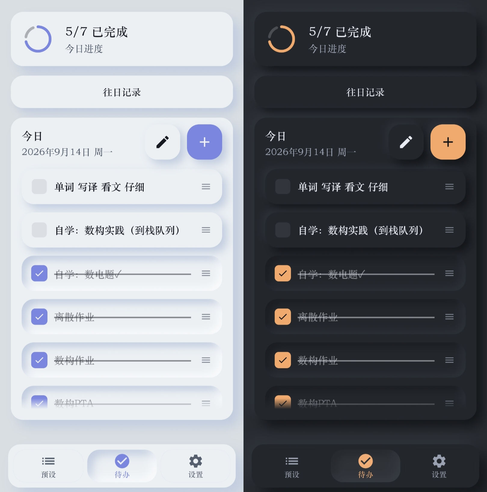
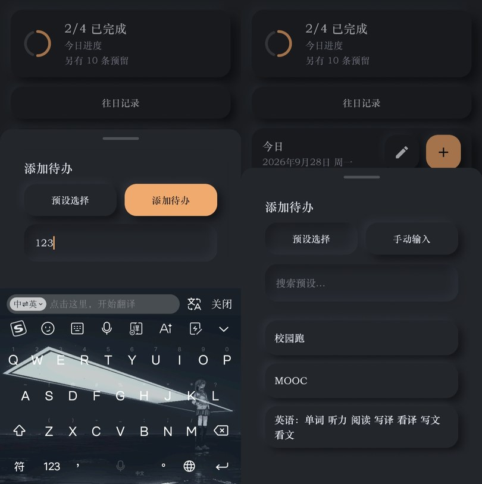
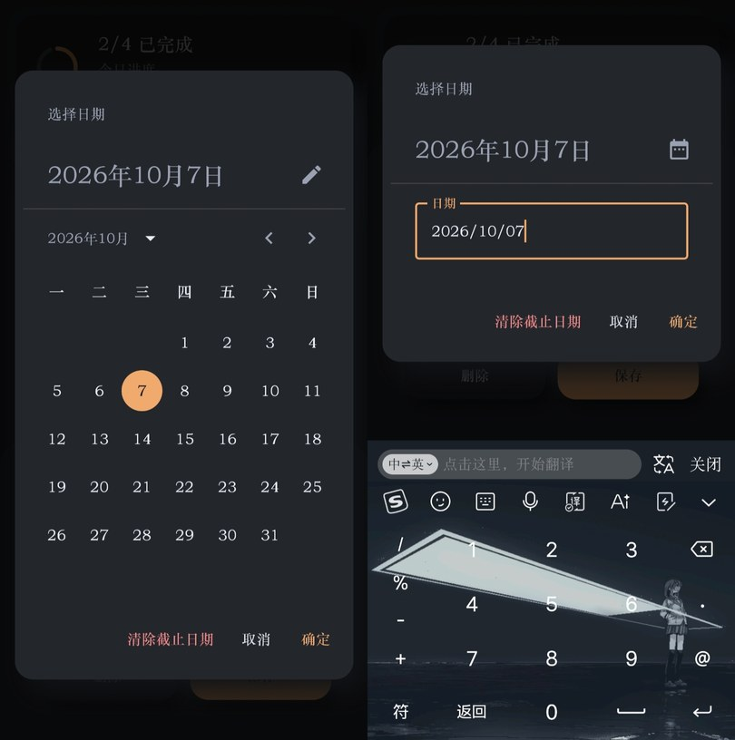
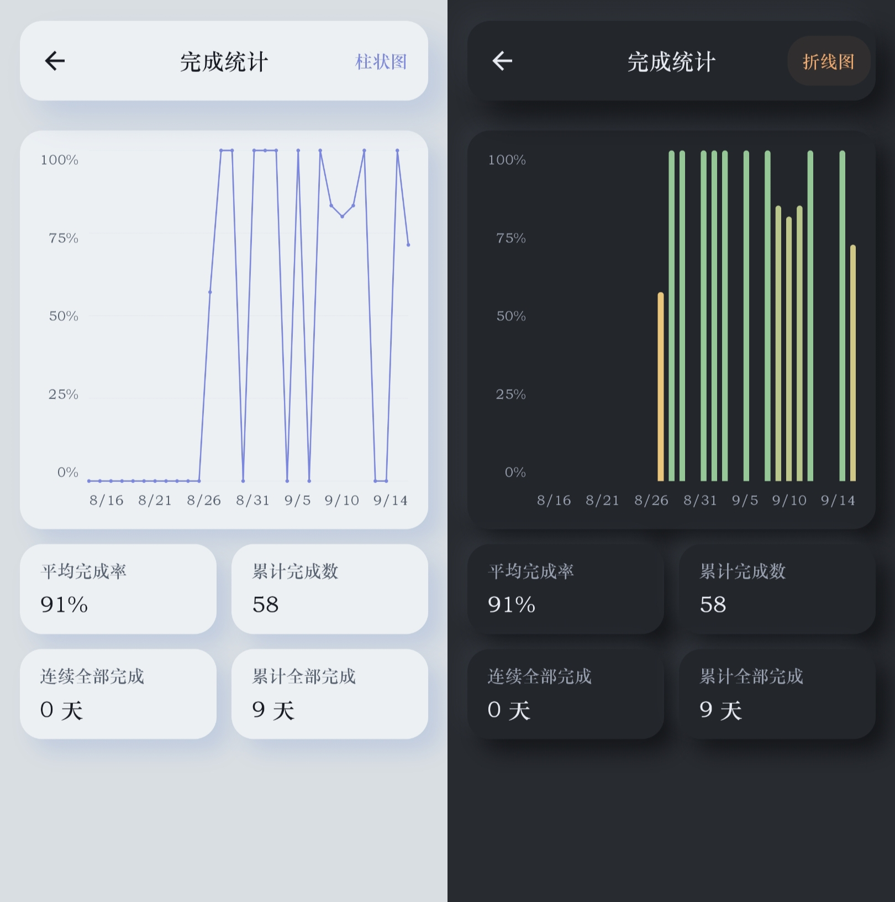
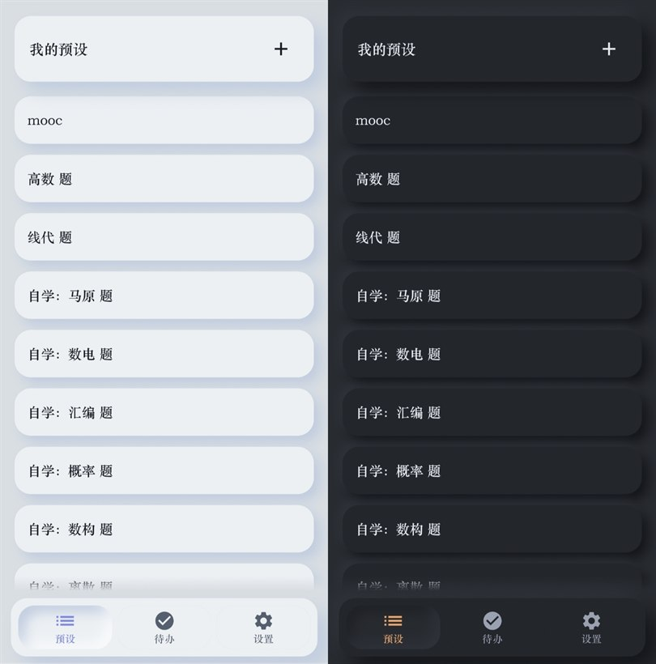
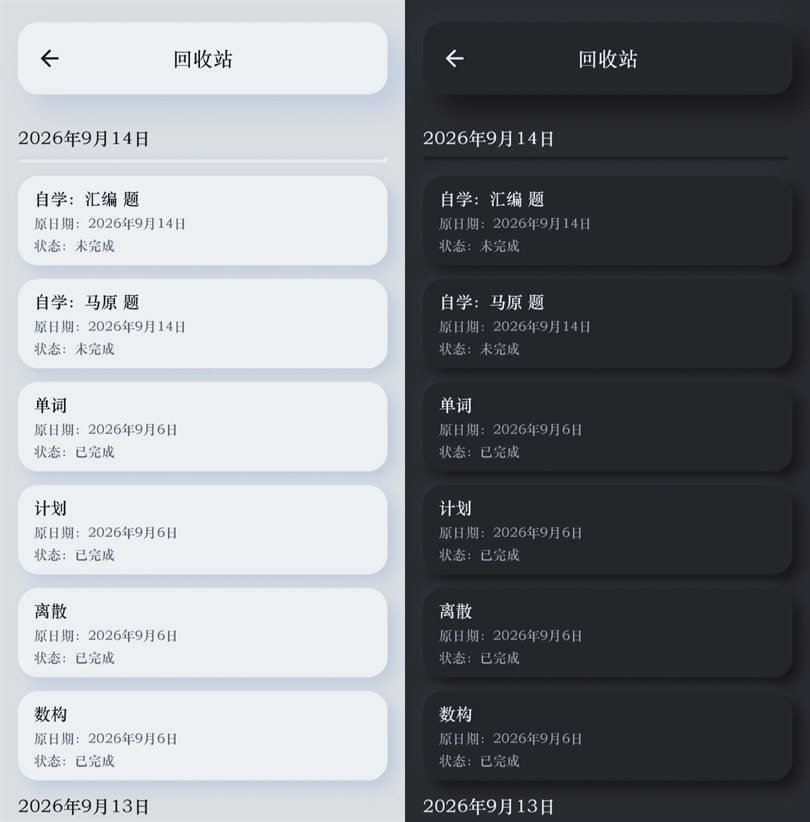
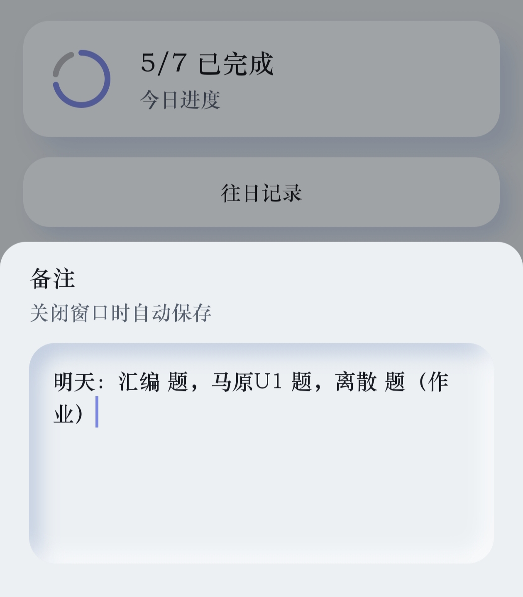
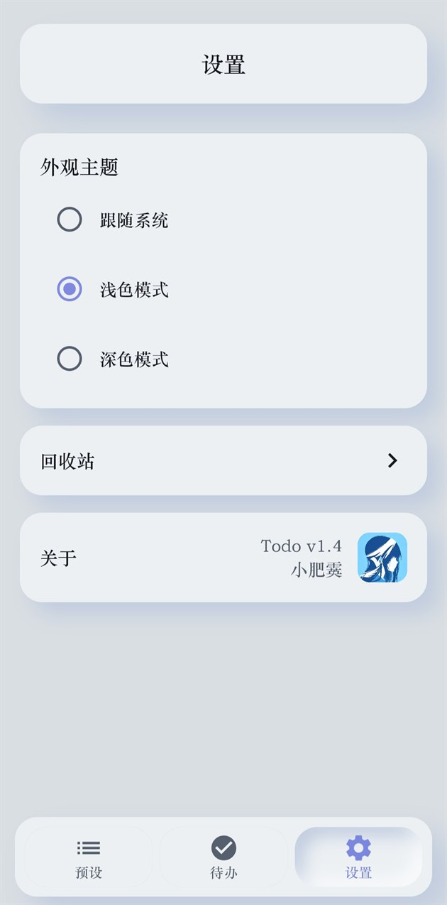
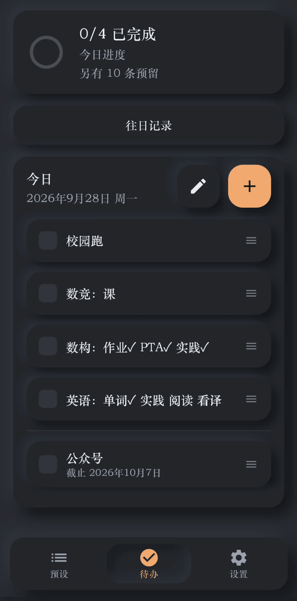

<div align="center">


# Todo

**新拟态风格（Neumorphism）的 Android 每日待办清单**

Kotlin 2.2 · Jetpack Compose · Room · 纯本地存储 · 零权限


-3DDC84?logo=android&logoColor=white)


[**下载最新 APK**](https://github.com/aliezXDD/Todo/releases/latest) ｜ [截图](#截图) ｜ [功能](#功能) ｜ [构建](#构建) ｜ [更新日志](#更新日志)

</div>

---

因为网上待办软件功能太繁杂、页面不清晰所以自己做了一个，只有待办、预设、备注、统计这些常用功能，下面是AI出来的软件操作、项目相关readme，希望大家用得开心ヾ(≧▽≦*)o

一个只把「每天列清单 → 打勾完成 → 看完成率变化」这件事做好的待办应用。界面是完整的新拟态风格：凸起的卡片、凹陷的输入框、按下去会陷进去的按钮，浅色和深色各一套。所有数据只存在手机上，应用**不申请任何权限**——连网络权限都没有（`AndroidManifest.xml` 里没有任何 `<uses-permission>`）。

## 功能

| 模块 | 说明 |
| --- | --- |
| **今日待办** | 勾选完成、按住 `≡` 拖动排序、点条目改内容或删除；设了「截止日期」的条目作为**预留**留在清单里，到期才计入统计 |
| **预设** | 常用待办存成预设：单击编辑、双击直接加为今日待办、长按多选批量添加，支持搜索过滤 |
| **完成统计** | 最近 30 天柱状图 / 折线图一键切换；下方四张历史卡片：平均完成率、累计完成数、连续全部完成、累计全部完成 |
| **回收站** | 7 天前的待办自动归档，可还原回它原来的日期，或永久删除（二次确认） |
| **备注** | 全局一条、不随日期清空，关闭窗口自动保存 |
| **主题** | 跟随系统 / 浅色 / 深色，光影全部自绘 |

细节操作提示：

| 想做的事 | 怎么做 |
| --- | --- |
| 加一条今日待办 | 首页右下角 `+`，或双击预设页的某条预设 |
| 一次加好几条 | 长按预设进入多选，勾选后一次全部添加 |
| 写备注 | 首页 `+` 左边的铅笔 |
| 回看历史清单 | 首页「往日记录」，按日期从新到旧 |
| 还原删掉的待办 | 设置 → 回收站；长按任意条目可多选批量还原 |

## 截图

> 除备注、设置外，每张图左侧为浅色模式、右侧为深色模式。

**今日待办**：进度环 + 当天清单 + 底部导航



**添加待办**：左侧手动输入、右侧预设选择；输入框一有内容，右侧按钮就直接变成「添加待办」



**截止日期**：给待办设一个期限，可以从日历里挑，也可以直接手输



**完成统计**：柱状图 / 折线图可切换，下方四张历史统计卡片



**预设**：把常用待办存下来，随取随用



**回收站**：删除的待办可还原，按原日期分组



**备注**：全局一条，关闭窗口自动保存



**设置**：主题切换、回收站入口、版本信息



**按压反馈**：凸起 → 凹陷是连续过渡，不是简单的透明度或缩放变化



## 时间与数据规则

- **一天从凌晨 4 点开始**：00:00–03:59 记在「昨天」，熬夜打卡不会把清单算到新的一天上。
- **自动归档**：应用启动时和每天定时任务会补齐历史统计；把 **7 天前**的待办移入回收站；清理回收站里 **超过 30 天**的记录。
- **数据全部在本机**：Room 数据库（待办、预设、回收站、每日统计）+ DataStore（主题、备注、归档日期）。没有账号，也没有云同步。

## 技术栈

| 项 | 版本 |
| --- | --- |
| 语言 / UI | Kotlin 2.2.10、Jetpack Compose（BOM 2026.02.01）、Material 3 |
| 架构 | 单模块分层：`data` / `domain` / `ui` / `worker` / `util`，UseCase 承载业务 |
| 依赖注入 | Hilt 2.59（含 hilt-work） |
| 本地存储 | Room 2.7.2（KSP）、DataStore Preferences 1.1.1 |
| 后台任务 | WorkManager 2.9.0（每日归档） |
| 其他 | Navigation Compose、Coroutines / Flow、`sh.calvin.reorderable` 2.4.0（拖拽排序） |
| 构建 | AGP 9.2.1、Gradle 9.4.1、JDK 17、compileSdk / targetSdk 36、minSdk 31 |

## 项目结构

```
app/src/main/java/com/todo/
├── MainActivity.kt              # 单 Activity，处理启动闪屏与主题
├── TodoApp.kt                   # Application：Hilt 入口 + 启动归档
├── data/
│   ├── local/                   # Room 实体 / DAO / 数据库 / DataStore
│   └── repository/              # 待办、预设、回收站、统计四个仓库
├── domain/
│   ├── model/                   # 领域模型
│   └── usecase/                 # 业务用例（增删改、排序、归档、清理、统计）
├── ui/
│   ├── component/               # 拟态基础组件（卡片、按钮、弹窗、FAB、Toast…）
│   ├── navigation/              # 底部导航与 NavGraph
│   ├── screen/                  # 待办 / 统计 / 预设 / 回收站 / 设置 / 历史
│   └── theme/                   # 颜色、字体、形状、拟态光影、动画参数
├── util/                        # 日期工具（逻辑日）、常量
└── worker/                      # 每日归档定时任务
```

## 关于拟态实现

- 光影全部用 Compose `Canvas` 自绘（偏移 + `BlurMaskFilter` 模糊），没有引入任何第三方拟态 UI 库。
- 全站统一一个圆角半径 **18dp**（勾选框这类小方块用 6dp 的 `Marker`，否则会被 Compose 收敛成正圆）。
- 凸起 = 浅色高光 + 深色投影，凹陷 = 反向路径裁剪出的内阴影；按压反馈是「凸起 → 凹陷」的连续过渡。
- 浅色模式下凸起面不加白色高光（纯白在浅灰底上会显脏），深色模式才用亮色描边。

## 构建

需要 JDK 17+ 与 Android SDK Platform 36。

```bash
# 调试包
./gradlew assembleDebug        # Windows: gradlew.bat assembleDebug

# 正式包（需先配置签名，否则产物未签名）
./gradlew assembleRelease
```

发布签名从 **`local.properties`**（已被 `.gitignore` 忽略）或同名环境变量读取，未配置时 release 产物保持未签名：

```properties
RELEASE_STORE_FILE=../todo-release.jks
RELEASE_STORE_PASSWORD=******
RELEASE_KEY_ALIAS=******
RELEASE_KEY_PASSWORD=******
```

## 下载与安装

到 [Releases](https://github.com/aliezXDD/Todo/releases/latest) 下载最新 APK 直接安装即可，要求 **Android 12（API 31）及以上**。后续版本与旧版本使用同一签名，**可以直接覆盖安装并保留数据**。

## 更新日志

每个版本的完整说明见 [Releases](https://github.com/aliezXDD/Todo/releases)。

### v1.4.2（2026-09-27）

- 新增**截止日期**：期限内作为「预留」留在今日清单、不计入任何一天的统计；完成时记在完成那天，逾期未完成则记在截止日那天
- 今日进度卡补一行「另有 N 条预留」；清单里「今天 / 预留」两组用分隔线分开，同一天到期的预留之间可以拖动排序
- 备注面板改为可下滑关闭、键盘弹起不再抖动；添加待办面板改为左「预设选择」右「手动输入」，输入后按钮直接变「添加待办」
- 修复：日历「今天」与选中日形状不一致、选年份列表没有背景、到期预留待办结清滞后

### v1.4.1（2026-09-23）

- 手动输入框有内容时，再点一次即可提交（与键盘「完成」同一行为，可连续录入）
- 修复添加待办面板按钮高亮区域与边框不重合

### v1.4（2026-09-12）

- 统一「一天」以凌晨 4 点为界；统计页四张卡片改为历史口径；备注改为全局一条、关窗即存
- 修复冷启动闪「暂无待办」、并发归档写入重复条目、图表纵轴「100%」折行

### 更早版本

v1.0 – v1.3：拟态组件体系、每日统计与图表、预设、回收站、备注、主题切换等逐步成型。

## 已知限制

- 仅支持竖屏，界面按竖屏排版。
- 数据只在本机：没有云同步，也没有导出 / 导入。
- release 构建未开启代码压缩（`isMinifyEnabled = false`）。

## 许可证

本项目基于 [MIT License](LICENSE) 开源，Copyright © 2026 aliezXDD。
